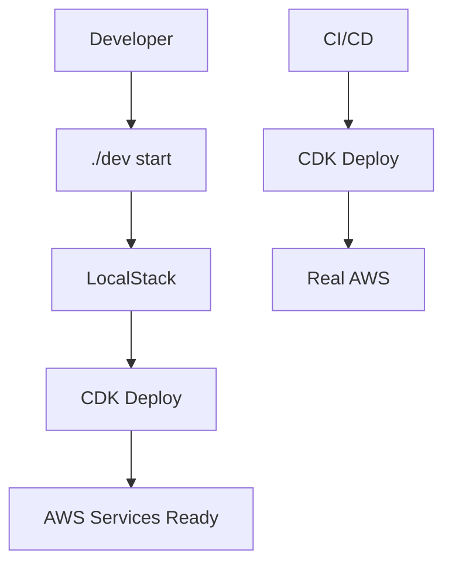

# 🏗️ Ecommerce Infrastructure

Modern, scalable AWS-native infrastructure for ecommerce microservices platform.

## 🎯 Overview

This repository provides **Infrastructure as Code** for building and deploying ecommerce microservices using **AWS-native services**. Following **Technology Decisions AWS-Centric (TDAC)** principles, it uses AWS CDK for consistent infrastructure across local development and production environments.

## 🏛️ Architecture

### TDAC-Compliant AWS Services

| Component | Local (LocalStack) | Production (AWS) |
|-----------|-------------------|------------------|
| **Database** | RDS PostgreSQL | RDS PostgreSQL |
| **Messaging** | Amazon MQ (RabbitMQ) | Amazon MQ (RabbitMQ) |
| **Cache** | ElastiCache Redis | ElastiCache Redis |
| **Identity** | Cognito User Pools | Cognito User Pools |
| **Storage** | S3 | S3 |
| **API Gateway** | API Gateway | API Gateway |
| **Service Mesh** | App Mesh | App Mesh |
| **Monitoring** | CloudWatch/X-Ray | CloudWatch/X-Ray |

### Deployment Strategy



## 🚀 Quick Start

### Prerequisites

- **Docker Desktop** (for LocalStack)
- **Node.js 18+** & **pnpm** (for CDK)
- **AWS CLI** (optional, for real AWS deployment)

### Local Development

```bash
# Navigate to local development environment
cd local/

# Start everything (LocalStack + CDK deployment)
./dev start

# Check status
./dev status

# View logs
./dev logs

# Stop everything
./dev stop

# Clean restart (removes all data)
./dev clean
```

### What Happens During `./dev start`

1. **🐳 Container Startup**: LocalStack starts with all AWS services
2. **⏳ Health Check**: Waits for LocalStack to be ready
3. **📦 CDK Install**: Installs dependencies if needed
4. **🏗️ CDK Bootstrap**: Sets up CDK toolkit in LocalStack
5. **🚀 Infrastructure Deploy**: Creates all AWS resources
6. **✅ Ready**: All services available at localhost endpoints

## 📋 Available Services

After running `./dev start`, you'll have:

| Service | Endpoint | Purpose |
|---------|----------|---------|
| **LocalStack** | `http://localhost:4566` | AWS services endpoint |
| **LocalStack Health** | `http://localhost:4566/_localstack/health` | Service health check |
| **RDS PostgreSQL** | `localhost:5432` | Primary database |
| **ElastiCache Redis** | `localhost:6379` | Caching layer |
| **Amazon MQ** | `localhost:5672` | Message broker |
| **S3** | `http://localhost:4566` | Object storage |
| **API Gateway** | `http://localhost:4566` | API routing |

## 🏗️ CDK Infrastructure

### Project Structure

```
aws/
├── bin/
│   └── ecommerce-app.ts          # CDK app entry point
├── lib/
│   ├── constructs/
│   │   ├── data/
│   │   │   ├── database-construct.ts    # RDS PostgreSQL
│   │   │   └── cache-construct.ts       # ElastiCache Redis
│   │   ├── messaging/
│   │   │   └── amazon-mq-construct.ts   # Amazon MQ RabbitMQ
│   │   ├── networking/
│   │   │   └── vpc-construct.ts         # VPC + Security Groups
│   │   ├── identity/
│   │   │   └── cognito-construct.ts     # User authentication
│   │   ├── storage/                     # S3 buckets (planned)
│   │   └── search/                      # OpenSearch (planned)
│   ├── providers/
│   │   ├── localstack-provider.ts      # LocalStack configuration
│   │   ├── aws-provider.ts             # AWS configuration
│   │   └── environment-provider.ts     # Environment abstraction
│   └── ecommerce-infrastructure.ts     # Main stack
├── config/
│   └── environments.ts                 # Environment configurations
└── package.json                        # Dependencies & scripts
```

### Environment Configuration

The CDK stack supports multiple environments:

```typescript
// Local development (LocalStack)
export const LOCAL_CONFIG = {
  environment: 'local',
  isLocalStack: true,
  region: 'us-east-1',
  // ... database, messaging configs
}

// Production environments
export const PROD_CONFIG = {
  environment: 'prod',
  isLocalStack: false,
  account: '123456789012',
  region: 'us-east-1',
  // ... production-specific configs
}
```

## 🔧 Manual CDK Operations

While `./dev start` handles everything automatically, you can run CDK commands manually:

```bash
cd aws/

# Install dependencies
pnpm install

# Synthesize CloudFormation template
pnpm run synth:local

# Deploy to LocalStack
pnpm run deploy:local

# Deploy to AWS environments
pnpm run deploy:dev
pnpm run deploy:staging
pnpm run deploy:prod

# Destroy infrastructure
pnpm run destroy:local
```

## 🌍 Production Deployment

### AWS Account Setup

1. **Configure AWS CLI**:
   ```bash
   aws configure
   ```

2. **Bootstrap CDK** (one-time per account/region):
   ```bash
   cd aws/
   pnpm run bootstrap:aws
   ```

3. **Deploy to Environment**:
   ```bash
   pnpm run deploy:prod
   ```

### CI/CD Integration

The CDK can be integrated with GitHub Actions, AWS CodePipeline, or any CI/CD system:

```yaml
# Example GitHub Action
- name: Deploy Infrastructure
  run: |
    cd aws/
    pnpm install
    pnpm run deploy:prod
  env:
    AWS_ACCESS_KEY_ID: ${{ secrets.AWS_ACCESS_KEY_ID }}
    AWS_SECRET_ACCESS_KEY: ${{ secrets.AWS_SECRET_ACCESS_KEY }}
```

## 🐛 Troubleshooting

### LocalStack Issues

```bash
# Check LocalStack health
curl http://localhost:4566/_localstack/health

# View LocalStack logs
./dev logs

# Reset everything
./dev clean

# Check Docker Desktop is running
docker info
```

### CDK Issues

```bash
# Re-bootstrap if needed
cd aws/
cdklocal bootstrap

# Check CDK context
cat cdk.context.json

# View detailed deployment logs
cdklocal deploy --context environment=local --verbose
```

### Common Issues

| Issue | Solution |
|-------|----------|
| `LocalStack not running` | Ensure Docker Desktop is started |
| `CDK bootstrap failed` | Run `./dev clean` and try again |
| `Port already in use` | Stop conflicting services or change ports |
| `CDK deploy timeout` | Increase timeout in CDK config |
| `Database connection failed` | Wait longer for RDS to initialize |

## 📊 Monitoring & Observability

### LocalStack Dashboard

- **Web UI**: https://app.localstack.cloud (requires LocalStack account)
- **CLI**: Use `awslocal` commands to inspect resources

### AWS Resources Inspection

```bash
# List RDS instances
awslocal rds describe-db-instances

# List S3 buckets
awslocal s3 ls

# Check parameter store
awslocal ssm get-parameters-by-path --path /ecommerce/local --recursive

# View CloudFormation stacks
awslocal cloudformation list-stacks
```

## 🔒 Security

### Local Development

- Uses test credentials (`test:test`) for LocalStack
- All traffic is local/containerized
- No real AWS resources or costs

### Production

- Uses IAM roles and policies
- Secrets stored in AWS Secrets Manager
- VPC with private subnets for databases
- Security groups with minimal access

## 🚀 Performance

### Local Development

- **Cold start**: ~30-60 seconds (LocalStack + CDK deployment)
- **Warm start**: ~10 seconds (LocalStack only)
- **Resource usage**: ~2GB RAM for LocalStack

### Optimization Tips

```bash
# Skip CDK deployment if infrastructure hasn't changed
docker-compose --profile core up -d

# Use LocalStack persistence to avoid re-creating resources
# (Already configured in docker-compose.yml)
```

## 🤝 Contributing

### Adding New Infrastructure

1. **Create Construct**:
   ```bash
   touch aws/lib/constructs/storage/s3-construct.ts
   ```

2. **Follow Patterns**:
   - Use environment providers for config differences
   - Add both LocalStack and AWS implementations
   - Include comprehensive parameter store configuration

3. **Update Main Stack**:
   ```typescript
   // In ecommerce-infrastructure.ts
   this.storage = new S3Construct(this, 'Storage', {
     provider,
     // ... props
   });
   ```

4. **Test Locally**:
   ```bash
   ./dev clean  # Clean restart to test new infrastructure
   ```

### Code Standards

- **TypeScript**: Strict typing for all CDK constructs
- **SOLID Principles**: Single responsibility, dependency injection
- **Environment Agnostic**: Use providers for environment differences
- **Parameter Store**: All configuration via AWS Systems Manager

## 📚 Documentation

- **[ADR-029](../ecommerce-documentation/architecture/adr/ADR-029-developer-environment-tooling-strategy.md)**: Developer environment strategy
- **[ADR-046](../ecommerce-documentation/architecture/adr/ADR-046-local-development-environment-orchestration.md)**: Local development orchestration
- **[TDAC Documentation](../ecommerce-documentation/architecture/technology-decisions-aws-centeric)**: AWS-centric technology decisions
- **[Implementation Specs](../ecommerce-documentation/implementation-specs/infrastructure/)**: Detailed implementation specifications

## 📄 License

This infrastructure code is part of the ecommerce platform and follows the project's licensing terms.

---

## 🎯 Quick Reference

```bash
# Start everything
./dev start

# Stop everything  
./dev stop

# Check health
./dev status

# View what's running
./dev logs

# Clean restart
./dev clean

# Get help
./dev --help
```

**🚀 Ready to build AWS-native microservices!**